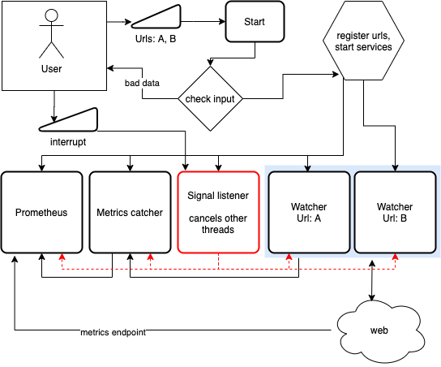

# URLWatch

Service for watching urls for liveness.

```
Usage:
  urlwatch start [flags]

Flags:
  -h, --help              help for start
  -i, --interval string   how long to wait between checks (default "30s")
  -p, --port int          port the metrics will be servied from (default 80)
  -t, --timeout string    how long to wait before cancelling a connectino request (default "2s")
      --url strings       provide each url that needs to be tracked

```

## How it works



## Run locally

```
$ go run main.go start --url https://httpstat.us/200 --url https://httpstat.us/503 --port 8080
starting watcher service
watching urls:
https://httpstat.us/200
https://httpstat.us/503
2020/11/03 23:26:00 checking url:  https://httpstat.us/200
2020/11/03 23:26:00 checking url:  https://httpstat.us/503
```

## Deploy

### The easy way

```
kubectl apply -f deploy/deploy.yaml
# wait 30 seconds or watch the pod logs until the first url checks occur
kubectl port-forward deploy/urlwatch 8080:80
```

now visit http://localhost:8080/metrics in your browser

### The hard way

#### Build docker image

```
docker build -t your_registry/account_name/urlwatch:1 .
docker push your_registry/account_name/urlwatch:1
```

#### Helm deploy

```
$ helm install urlwatch deploy/urlwatch --set image.repository=your_registry/account_name/urlwatch --set image.tag=1
NAME: urlwatch
LAST DEPLOYED: Tue Nov  3 22:01:46 2020
NAMESPACE: default
STATUS: deployed
REVISION: 1
NOTES:
1. Get the application URL by running these commands:
  export POD_NAME=$(kubectl get pods --namespace default -l "app.kubernetes.io/name=urlwatch,app.kubernetes.io/instance=urlwatch" -o jsonpath="{.items[0].metadata.name}")
  echo "Visit http://127.0.0.1:8080 to use your application"
  kubectl --namespace default port-forward $POD_NAME 8080:80
```

## Test

```
go test -cover -v ./...
```